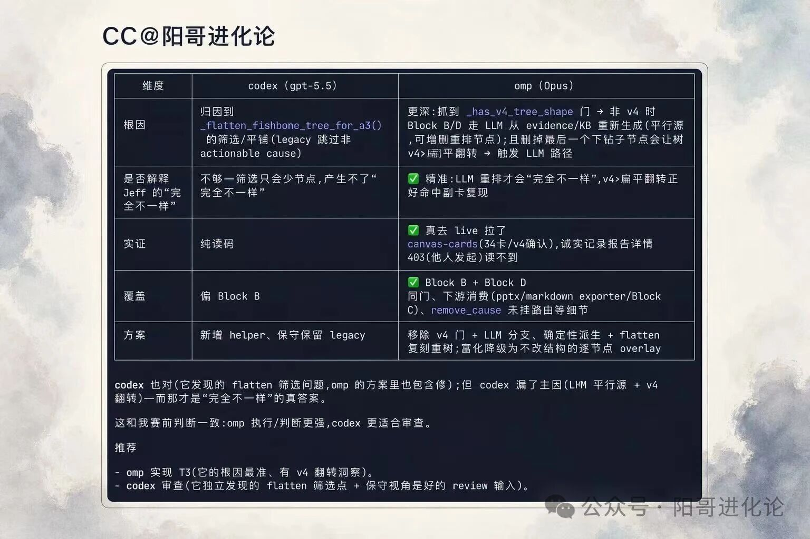
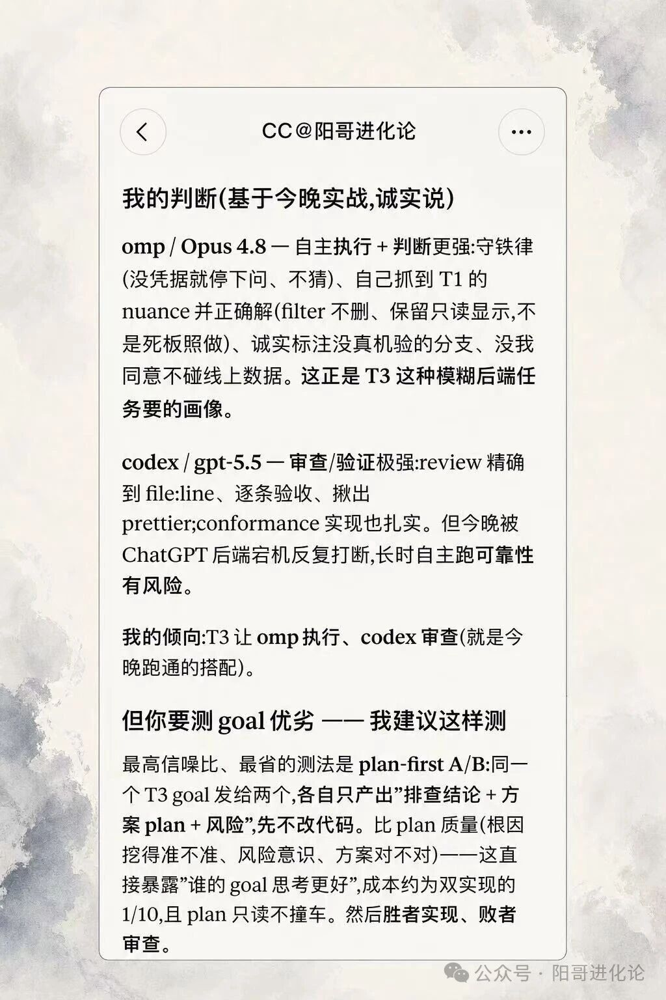

<div align="center">

# CTO Orchestration

> *「你不再亲手写代码——你当 CTO，指挥一群异构 agent 替你交付生产级改动。」*

[](SKILL.md)
[](../../README.md)
[](#前置依赖与安装)
[](../../LICENSE)

**把"自己写代码"变成"派工 + 异构对抗评审 + 旗标门控"——一个人，一群 agent，生产级交付。**

[看效果](#效果示例) · [模型策略](#三层异构模型策略) · [安装](#前置依赖与安装) · [触发方式](#触发方式) · [它和同类有什么不同](#它和同类有什么不同) · [安全边界](#安全边界)

</div>

---

<div align="center">



<sub>真实 plan-first A/B：同一个 goal 派给 omp(Opus) 与 codex(GPT)，各自先出排查结论 + 方案 plan（不改代码），对比谁挖得深——据此定谁执行、谁评审。</sub>

</div>

---

## 它解决什么问题

单 agent 一把梭是公认反模式——它**声称完成但没 commit**、**自己评审自己说没问题**、CI **全绿但产物早就停更**；多 agent 又乱成一团：谁派谁、谁信谁、死了怎么知道？缺的从来不是工具，是**纪律**。

`cto-orchestration` 把真实多 agent 项目打磨出的编排纪律沉淀成 skill——编排者绝不写产品代码，执行/评审异构分离，watcher 盯**存活信号**（agent 死了退回 shell ≠ 任务完成），行为变更藏旗标。它编码的是**派发链路里所有会骗你的静默失败**：假完成、假评审、假绿灯、孤儿进程空转。整体理念 **A²**（Agentic AI × Anything，一拖多）见[仓库根 README](../../README.md)。

> **为什么是 tmux 交互，而不是 `claude -p` / subagent 派发？** 编排不是"发了就等结果"——你要在 agent
> 跑偏时纠偏、塞进新事实、插入临时任务。headless / subagent 跑完才回、中途插不进话；tmux `send-keys`
> 让你随时 steering，这是这套工作流能用的前提。

## 效果示例

让谁执行、谁评审，不靠拍脑袋——跑一次 **plan-first A/B**：同一个 goal 同时派给两个模型，各自只产出"排查结论 + 方案 plan + 风险"（**先不改代码**），再对比 plan 质量。上方截图是一次真实对比，要点如下（原文见[致谢](#致谢)）：

| 维度 | codex（GPT）的 plan | omp（Opus）的 plan |
|---|---|---|
| 根因 | 读码归因到表层筛选/平铺函数的 legacy 分支 | 更深：抓到上游结构判定门，非预期结构时走 LLM 重生成——真正的平行数据源 |
| 实证 | 纯读码推断 | 真去 live 环境拉产物数据逐条核对 |
| 覆盖 | 偏单一模块 | 跨上下游消费链路（导出器 / 相邻模块） |
| 方案 | 新增 helper、保守保留 legacy | 移除冗余分支、确定性派生重建 |

> 两份 plan 都对（codex 发现的表层问题 omp 也含修），但 omp 挖到了"完全不一样"的真根因。**于是这个项目定 omp 执行、codex 评审——plan-first A/B 让模型选型有据可依，不是凭感觉。**

## 三层异构模型策略

这是核心设计，也是它和别人最不一样的地方——**三个位置，刻意用不同强度/不同家族的模型**（人话版；工程判据 SoT 见 [SKILL §0 角色分工](SKILL.md)）：

| 层 | 角色 | 模型选择 | 为什么 |
|---|---|---|---|
| **编排** | 你（CTO） | **最强模型**，如 Fable 5 | 定方向、拆 goal、判评审、做决策——智力最值钱的一层，丝滑度直接决定全局质量 |
| **执行** | omp / Claude Code | **够用就行的相对弱模型**（如 Opus） | 类比工程师按图施工：goal 写得够细，执行不需要最强模型；omp 执行效率高、吞吐好 |
| **评审** | codex | **异构家族**（GPT 系） | 和执行**不同 lineage**，失败模式独立，交叉评审才抓得到双方都漏的真问题——同模型自审 = self-preference bias |

> **关键洞察**：CTO 用强模型定方向、工程师用够用的模型执行——把算力花在最该花的地方。执行侧 `omp` 可无缝换成 **Claude Code**，没区别；甚至三层全用同一模型也跑得通，只是评审的对抗价值会打折。**评审侧推荐绑 codex**——这套对抗式评审循环是专门围着它调出来的。

<div align="center">



<sub>真实复盘片段：为什么让 omp(Opus) 执行、codex(GPT) 评审的现场判断。</sub>

</div>

## 前置依赖与安装

**依赖**：`tmux` + 一个执行 agent CLI（[`omp`/oh-my-pi](https://github.com/can1357/oh-my-pi)，也可换 **Claude Code**）+ `codex`（[评审，异构推荐绑它](https://github.com/openai/codex)）。三个**首次用前都要登录、配好模型**；分工见[上一节](#三层异构模型策略)。

**装**（Claude Code plugin marketplace，推荐）：

```text
/plugin marketplace add martin1847/evolab
/plugin install cto-orchestration@evolab
```

> 手动拷贝、其他 runtime（Cursor / Cline…）、以及**配套的 `repo-governance-bootstrap`**（cto 派工依赖项目先有治理骨架，二者一起装才成体系）——完整装法见[仓库 README](../../README.md)。

### 装完第一句话

对你的强模型编排会话（推荐 Fable 5）说：

```text
进入 CTO 编排模式。我来定方向，你不写产品代码——按 cto-orchestration 的
派工协议，把这个需求拆成 goal 文档派给 omp 执行、codex 评审，watcher 盯着，
对抗评审到 approve 再向我汇报。需求是：<你的需求>
```

## 触发方式

完整触发场景（自动加载行为的 SoT）见 [SKILL frontmatter 的 `description`](SKILL.md)——典型如"你做 CTO / 编排者，别自己写代码"、"派 omp 实现、codex 评审"、"goal 模式派发"、"管理并行会话"、"起 watcher 盯着"。

## 它会交付什么

（产物速览；落盘纪律工程判据 SoT 见 [SKILL §5 状态落盘](SKILL.md)）

| 产物 | 内容 |
|---|---|
| `*_GOAL.md` | 带 file:line 预判、交付物清单、guardrails 的派工文档 |
| `*_REVIEW_codex.md` | codex 异构评审的 severity 分级 findings + verdict，逐轮追加 |
| watcher 状态 | typed 信号：DONE / SESSION-GONE / AGENT-DEAD / HANG / WAITING-INPUT / STALLED-EXTERNAL |
| 复盘快照 | 交付清单 + 教训固化 + roadmap/ACTIVE_CONTEXT 翻转 |

## 它和同类有什么不同

不攻击同行，只讲路线差异：

| 维度 | 通用 agent 框架 / 全自动 DAG | 平台型（Web UI 派遣） | **cto-orchestration** |
|---|---|---|---|
| 谁做主 | agent 自主拆任务、自动跑 | UI 中央调度 | **编排者手写 goal、全程在场** |
| 评审 | 多为同构单评 / 质量门控 | 人工 review 门 | **异构对抗式循环**（不同模型） |
| 失败处理 | 假设自动化可信 | 看 dashboard | **存活检测 + 假完成/假绿灯的系统编码** |
| 形态 | 装框架 / 自托管 | 部署平台 | **一个 skill，跑在你已有的终端里** |
| 卖点 | 自动化（去睡觉） | 可视化协作 | **纪律**（别被假信号坑死） |

## 安全边界

一句话：**不可逆操作（push / PR / 迁移 / 删除 / 对外消息）先报后做、等明确放行；行为变更藏旗标默认零变化；交付走验证诚实三段式；编排者绝不写产品代码。** 完整判据见 [SKILL §3 变更纪律](SKILL.md) + 顶部三铁律。

## 文件结构

```
cto-orchestration/
├── SKILL.md                          # 给 agent 看的完整编排方法论（§0 角色 – §8 接入）
├── README.md                         # 本文件：给人看的安装+定位页（图存仓库根 assets/，不随 skill 安装）
└── references/
    ├── goal-template.md              # 派工 goal 文档模板
    ├── agent-watch/                  # watcher 工具集：dispatch/watch/teardown + hook（hook 主信号、抓屏降级）
    ├── review-dispatch.md            # codex 评审指令模板（冷上下文防 anchoring）
    ├── ops-prompt-template.md        # 运维 agent 间接取证提示词模板
    ├── frontend-verify.md            # 前端 fix 浏览器联调验证方法
    ├── retrospective.md              # 复盘仪式操作手册（memory 治理 + session 切换决策）
    └── agents-md-orchestration-section.md  # 接入项目 AGENTS.md 的委派边界增补
```

## 致谢

整理自公众号 **阳哥进化论** 的多 agent 编排实战，是 [evolab](../../README.md) 合集的旗舰 skill。理念 **A²**（Agentic AI × Anything，一拖多）。完整复盘原文：

- [A² 时代来临：Agentic AI × Anything](https://mp.weixin.qq.com/s/hC9EFNh7gTsq4PPlwViLiA)
- [上下文治理：一个人指挥一群 agent 的收口纪律](https://mp.weixin.qq.com/s/JbdQrJR5lBwjcTcS4fSWPQ)

## License

[MIT](../../LICENSE)

---

<div align="center">

*别自己写代码——当 CTO，派工去。*

</div>
