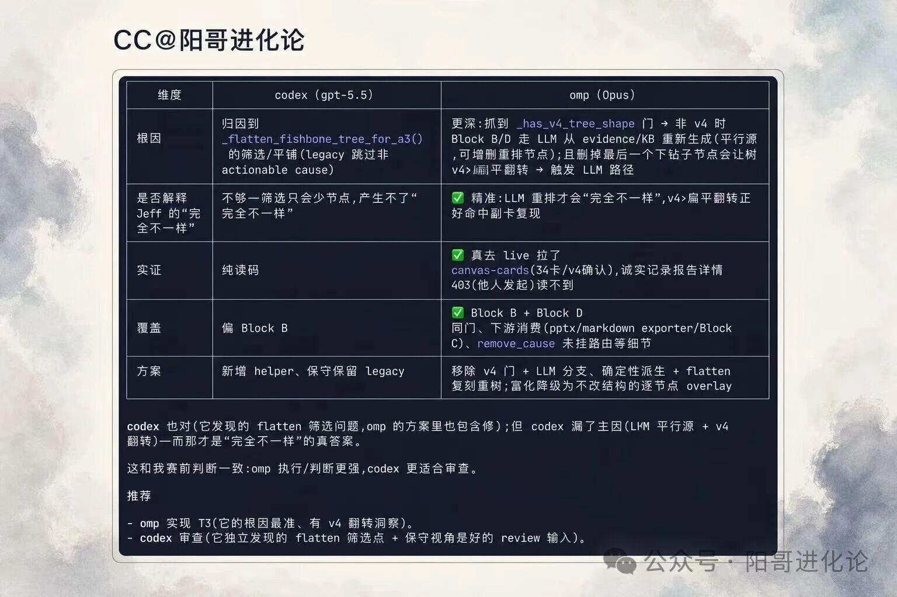

<div align="center">

# CTO Orchestration

> *「你不再亲手写代码——你当 CTO，指挥一群异构 agent 替你交付生产级改动。」*

[](SKILL.md)
[](../../README.md)
[](#安装)
[](../../LICENSE)

**把"自己写代码"变成"派工 + 异构对抗评审 + 旗标门控"——一个人，一群 agent，生产级交付。**



<sub>真实 plan-first A/B：同一个 goal 派给两个模型，各自只出排查结论 + 方案（不改代码），对比谁挖得深——据此定谁执行、谁评审。</sub>

</div>

---

## 它解决什么问题

单 agent 一把梭是公认反模式——**声称完成但没 commit**、**自己评审自己说没问题**、CI **全绿但产物早就停更**；多 agent 又乱成一团：谁派谁、谁信谁、死了怎么知道？缺的不是工具，是**纪律**。

本 skill 把真实多 agent 项目打磨出的编排纪律沉淀成条文 + 强制层：编排者绝不写产品代码，执行 / 评审用**不同 lineage** 的模型对抗，watcher 只认 **typed 终态信号**（agent 死了退回 shell ≠ 任务完成），行为变更先获批、逃生舱用 kill switch。它编码的是派发链路里所有会骗你的静默失败：假完成、假评审、假绿灯、孤儿进程空转。模型按活分档而不是按位置降级——上图的 plan-first A/B 就是选型依据：

| 维度 | codex（GPT） | omp（Opus） |
|---|---|---|
| 根因 | 读码归因到表层 legacy 分支 | 抓到上游结构判定门——真正的平行数据源 |
| 实证 | 纯读码推断 | 去 live 环境拉数据逐条核对 |
| 覆盖 | 单一模块 | 跨上下游消费链路 |

> 两份 plan 都对，但一份挖到了"完全不一样"的真根因——于是该项目定 omp 执行、codex 评审。工程判据见 [SKILL §0 角色分工](SKILL.md)。

> **为什么是 headless + 协议？** 抓屏 / 送按键随 CLI 版本漂移且实测仅七八成可靠。`agentctl` 让 worker 走引擎原生双工协议长驻（`agentctl steer` 轮内可达）；tmux 只做保活，状态永远是 typed exit code，不是屏幕。

## 安装

依赖：`tmux` + 一个执行 agent CLI（[omp](https://github.com/can1357/oh-my-pi) 或 Claude Code）+ [`codex`](https://github.com/openai/codex)（评审席，异构推荐绑它）；三者首次用前都要登录、配好模型。

```text
/plugin marketplace add martin1847/evolab
/plugin install cto-orchestration@evolab
```

手动拷贝、其他 runtime、以及**配套的 `repo-governance-bootstrap`**（派工依赖项目先有治理骨架）见[仓库 README](../../README.md)。装完对你的强模型编排会话说：

```text
进入 CTO 编排模式。我来定方向，你不写产品代码——按 cto-orchestration 的
派工协议，把这个需求拆成 goal 文档派给 omp 执行、codex 评审，watcher 盯着，
对抗评审到 approve 再向我汇报。需求是：<你的需求>
```

完整触发场景（自动加载行为的 SoT）见 [SKILL frontmatter 的 `description`](SKILL.md)。

## 它会交付什么

| 产物 | 内容 |
|---|---|
| `*_GOAL.md` | 带 file:line 预判、交付物清单、guardrails 的派工文档 |
| `*_REVIEW_codex.md` | 异构评审的 severity 分级 findings + verdict，逐轮追加 |
| watcher 状态 | typed 信号（全枚举 `agentctl states`；处置见 `references/agentctl/README.md`） |
| 复盘快照 | 交付清单 + 教训固化 + roadmap / ACTIVE_CONTEXT 翻转 |

## 它和同类有什么不同

| 维度 | 通用 agent 框架 / 全自动 DAG | 平台型（Web UI 派遣） | **cto-orchestration** |
|---|---|---|---|
| 谁做主 | agent 自主拆任务、自动跑 | UI 中央调度 | **编排者手写 goal、全程在场** |
| 评审 | 同构单评 / 质量门控 | 人工 review 门 | **异构对抗式循环** |
| 失败处理 | 假设自动化可信 | 看 dashboard | **存活检测 + 假完成 / 假绿灯的系统编码** |
| 形态 | 装框架 / 自托管 | 部署平台 | **一个 skill，跑在你已有的终端里** |

## 安全边界

**不可逆操作（push / PR / 迁移 / 删除 / 对外消息）先报后做、等明确放行；行为变更先获批、逃生舱用 kill switch；交付走验证诚实三段式；编排者绝不写产品代码。** 完整判据见 [SKILL §3 变更纪律](SKILL.md) + 顶部三铁律。

## 文件结构

`SKILL.md`（给 agent 的方法论主干，触发即加载）· `references/`（模板 / agentctl 工具集 / 各节机制展开，按 SKILL.md 各节指针按需读）· 本 README（给人看的定位 + 安装页，agent 不加载；图存仓库根 `assets/`，不随 skill 安装）。

---

<div align="center">

整理自公众号 **阳哥进化论** 的多 agent 编排实战（[A² 时代来临](https://mp.weixin.qq.com/s/hC9EFNh7gTsq4PPlwViLiA) · [上下文治理](https://mp.weixin.qq.com/s/JbdQrJR5lBwjcTcS4fSWPQ)）· [MIT](../../LICENSE)

*别自己写代码——当 CTO，派工去。*

</div>
